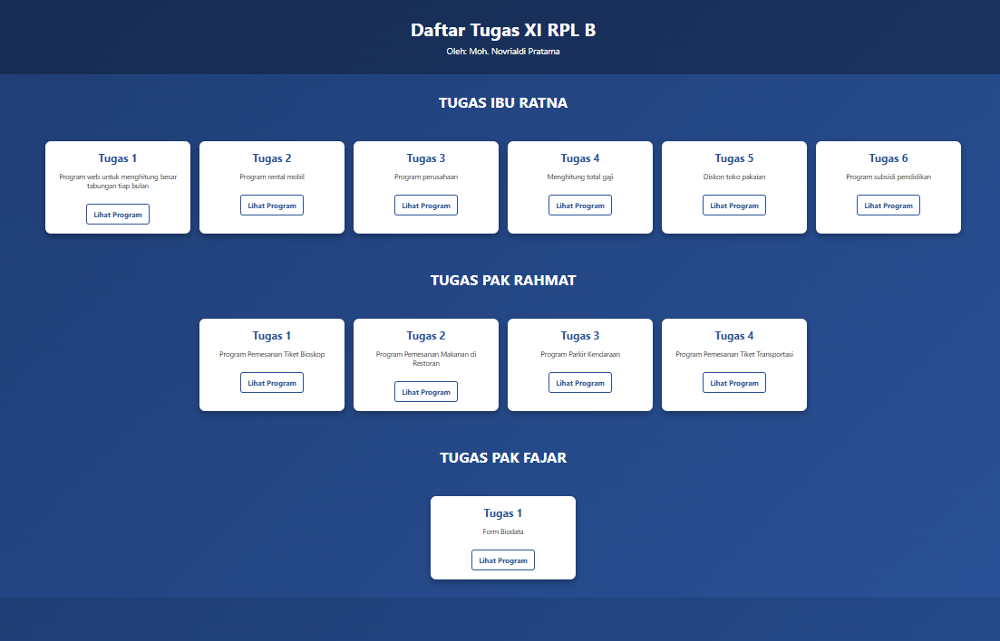

# 📘 Web Assignment Project - XI RPL B

Welcome to the **XI RPL B Web Assignment Repository**!  
This project contains a collection of simple PHP programs for learning and practicing web application development.  
Each assignment is neatly organized into folders based on the teacher in charge. This project is created by Moh.Novrialdi Pratama (Aldi).

---

## ✨ Key Features
- 📂 Well-structured folders grouped by teacher (*Ibu Ratna, Pak Rahmat, and Pak Fajar*).
- 🖥️ **Responsive design** for both desktop and mobile views.
- 🎨 Improved UI/UX with a cleaner, modern look.
- 🔄 Clear update history with proper documentation.

---
## 📅 Update History

### 🔹 October 09, 2025
- ➕ Added `Program Minimarket` as **"TUGAS 2"** to 📁 `pak-fajar` 
- 📝 Created `minimarket.php` inside 📁 `pak-fajar`.
- ✏ Edited `index.php` for adding `minimarket.php` inside 📁 `index.php`.
  
--- 

### 🔹 October 08, 2025

- ➕ Added `Program Pendaftaran Ulang SMK` and `Program Rental Mobil (Switchcase)` as **"TUGAS 7"** and **"TUGAS 8"** to `index.php` inside 📁 `ibu-ratna` 
- 📝 Created `smk.php` inside 📁 `ibu-ratna`.
- 📝 Created `rental2.php` inside 📁 `ibu-ratna`.
  
---

### 🔹 September 25, 2025
- ➕ Added **"TUGAS PAK FAJAR"** to the dashboard inside `index.php`.  
- 📁 Created `pak-fajar` directory.
- 📝 Created `subidi.php` inside `ibu-ratna`
- 📝 Created `formbio.php` inside `pak-fajar`.  
- 🎨 Improved responsive **UI/UX** on every page(s) include `index.php`.
- 🖥️ Improvement `README.md`.

---

### 🔹 September 24, 2025
- 📂 Separated assignments for **Ibu Ratna** and **Pak Rahmat** into different folders.  
- 🆕 Added **"Task 4: Salary Calculation"** under *Ibu Ratna’s section*.  
- 🆕 Added **"Task 5: Clothing Store Discount"** under *Ibu Ratna’s section*.  
- 📝 Created `totalgaji.php` → 📁 `ibu-ratna`.  
- 📝 Created `tokopakaian.php` → 📁 `ibu-ratna`.  

---

### 🔹 September 23, 2025
- ➕ Added **"TUGAS IBU RATNA"** section.  
- ➕ Added **"TUGAS PAK RAHMAT"** section.  
- 🎟️ Added **Movie Ticket Booking Program** (Pak Rahmat).  
- 🍽️ Added **Restaurant Ordering Program** (Pak Rahmat).  
- 🚗 Added **Vehicle Parking Program** (Pak Rahmat).  
- 🚌 Added **Transportation Ticket Booking Program** (Pak Rahmat).  
- 🖼️ Improved main page styling.  
- ⚙️ Added `php.yml` to 📁 `.github/workflows` for CI/CD.  

---

### 🔹 September 11, 2025
- 🏠 Created `index.php` as the main page.  
- 💰 Added **Task 1: Monthly Savings Calculator**.  
- 🚙 Added **Task 2: Car Rental Program**.  
- 🏭 Added **Task 3: Company Program**.  
- 📝 Created `tabungan.php`, `rental.php`, and `perusahaan.php`.  
- 🎨 Enhanced overall page styles.  

---

## 🚀 How to Run
1. Clone this repository (Localhost):
   ```bash
   git clone https://github.com/dii-php/full-tugasphp
2. Or you can open this site:
   ```bash
   https://full-tugasphp.page.gd/

## 📸 UI Preview

